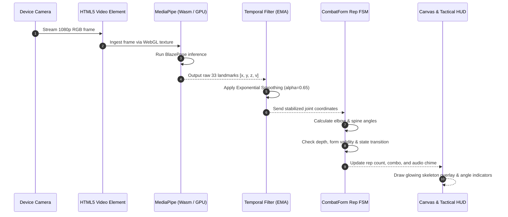

# CombatForm: How Body Points Are Scanned & Technologies Used

This document provides an in-depth technical explanation of **how body points and skeletal keypoints are scanned from a live camera feed**, the **underlying computer vision and machine learning technologies**, and the **frame-by-frame processing pipeline** running in CombatForm.

---

## 1. Technologies Used at a Glance

| Technology Layer | Tool / Framework | Role & Responsibility |
|---|---|---|
| **Core AI Model** | **Google MediaPipe Pose (BlazePose)** | Deep learning model predicting 33 3D skeletal landmarks. |
| **Execution Runtime** | **WebAssembly (Wasm) + SIMD** | Near-native CPU execution of compiled C++ inference routines inside web browsers. |
| **Hardware Acceleration** | **WebGL / WebGPU Shaders** | Hardware acceleration on the user's local smartphone or laptop GPU. |
| **Video Ingestion** | **HTML5 MediaStreams API** (`getUserMedia`) | Captures raw video frames from front/back smartphone or laptop webcams at 30–60 FPS. |
| **Visual Rendering** | **HTML5 Canvas 2D / WebGL** | Real-time tactical skeletal overlay, glowing joints, and form angle badges. |
| **Smoothing & Filtering** | **One-Euro Filter / Exponential Moving Average (EMA)** | Temporal jitter removal to stabilize joint coordinates across consecutive frames. |

---

## 2. How the AI Scans Body Points: The Two-Stage Pipeline

Processing an entire high-definition video frame ($1920 \times 1080$) through a heavy neural network every 16 milliseconds would overheat mobile phones and cause severe frame drops. 

To achieve **ultra-fast 30–60 FPS performance**, MediaPipe uses a **Two-Stage Detector-Tracker Pipeline**:

```
[ Raw Camera Stream: 1920x1080 @ 30-60 FPS ]
                      │
                      ▼
 ┌──────────────────────────────────────────────┐
 │ Stage 1: Detector (Person / ROI Detector)    │ ◄─── Runs ONLY ONCE on initial frame
 │ - Scans full frame for a human body          │      (or if user leaves the camera view)
 │ - Calculates bounding box & rotation angle   │
 └──────────────────────┬───────────────────────┘
                        │
                        ▼ (Cropped & Normalized ROI: 256x256)
 ┌──────────────────────────────────────────────┐
 │ Stage 2: Landmark Tracker (BlazePose)        │ ◄─── Runs EVERY FRAME (High Speed)
 │ - Predicts 33 3D skeletal landmarks          │
 │ - Computes landmark visibility scores        │
 │ - Automatically estimates NEXT frame's ROI   │
 └──────────────────────┬───────────────────────┘
                        │
                        ▼
       [ 33 Keypoints (x, y, z, visibility) ]
                        │
                        ▼
       [ Kinematics & Form Analysis Engine ]
```

### Stage 1: The Detector (Locating the Person)
- On the very first frame (or when the user re-enters the camera view), a lightweight convolutional detector locates the human body.
- It determines:
  1. Bounding box coordinates $(x_{\min}, y_{\min}, x_{\max}, y_{\max})$.
  2. Four alignment landmarks: Mid-hip center, point encoding body size, and two rotation points.
- This creates a **tight, normalized bounding box** (Region of Interest - ROI) around the user and rotates it upright.

### Stage 2: The Tracker (Sub-Millisecond Landmark Prediction)
- In all subsequent frames, the model **skips the detector completely**.
- Instead, it uses the previous frame's landmark positions to project where the body will be in the next frame.
- It crops only that small ROI ($256 \times 256$ pixels) and feeds it into the BlazePose neural network.
- **Why this matters for SIH:** This reduces computational overhead by over **85%**, allowing the system to run smoothly on low-end budget smartphones without thermal throttling or battery drain.

---

## 3. Inside the Neural Network: How Landmarks Are Extracted

BlazePose uses a custom convolutional neural network designed by Google Research, based on **MobileNetV2/V3 inverted bottlenecks with depthwise separable convolutions**:

```
                       [ Input: 256 x 256 x 3 RGB Tensor ]
                                      │
                                      ▼
                        [ Convolutional Feature Extractor ]
                           (Depthwise Separable Convolutions)
                                      │
                 ┌────────────────────┴────────────────────┐
                 ▼                                         ▼
      [ Heatmap Branch (2D) ]                   [ Regression Branch (3D) ]
  - 33 Probability Heatmaps                 - Metric-space (x, y, z) coordinates
  - Identifies (x, y) joint centers         - Depth 'z' relative to hip midpoint
                 │                                         │
                 └────────────────────┬────────────────────┘
                                      │
                                      ▼
             [ Output: 33 Landmarks (x, y, z, visibility, presence) ]
```

### 1. Heatmap Estimation (2D Coordinates)
- The network outputs a $64 \times 64$ probability heatmap for each of the 33 joints.
- The highest peak on each joint's heatmap corresponds to the 2D pixel coordinate $(x, y)$ of that joint (e.g., left elbow).
- Using heatmaps prevents the network from snapping to background clutter or shadows.

### 2. Direct Coordinate Regression (3D Depth)
- In parallel with heatmaps, a regression head predicts the depth $z$-coordinate for each landmark.
- $z$ represents the depth in meters relative to the subject's hips:
  - Negative $z$: Landmark is closer to the camera than the hips (e.g., hands reaching forward).
  - Positive $z$: Landmark is farther away from the camera than the hips.

### 3. Visibility and Presence Heads
For every single landmark $P_i$, the network predicts:
- **$v_i$ (Visibility Score $\in [0, 1]$):** The probability that the joint is not occluded by another body part, clothing, or furniture.
- **$p_i$ (Presence Score $\in [0, 1]$):** The probability that the joint is physically located within the camera frame.

---

## 4. Step-by-Step Execution Pipeline (Webcam to Rep Count)

Here is the exact lifecycle of a single video frame inside CombatForm:



---

## 5. Why MediaPipe Was Chosen Over Alternatives

| Feature / Metric | **Google MediaPipe Pose** *(CombatForm)* | **OpenPose** (CMU) | **YOLOv8-Pose** | **Apple ARKit / Body Tracking** |
|---|---|---|---|---|
| **Client-Side Browser Execution** | **Native WebAssembly & WebGL** | Heavy; requires native C++/CUDA | Requires ONNX Web runtime; heavier bundle | iOS Safari only; no Android or Desktop support |
| **Frame Rate on Budget Phones** | **30 – 60 FPS** | 2 – 5 FPS (Unusable without server GPU) | 12 – 20 FPS | 60 FPS (iOS only) |
| **Server Cost / Video Upload** | **$0.00 (Zero server load, 100% on-device)** | Extremely high ($0.05/minute GPU) | Moderate server GPU cost | $0.00 |
| **User Privacy** | **100% Private (No video leaves device)** | Video must be streamed to server | Video streamed to server | Private |
| **Keypoint Resolution** | **33 Keypoints** (Face, Hands, Feet, Spine) | 18 or 25 Keypoints | 17 Keypoints (No feet/hands detail) | Full 3D mesh (iOS only) |
| **Cross-Platform Support** | **Chrome, Safari, Edge, Android, iOS, Windows, Mac** | Linux / Windows only | All (with backend) | iOS / iPadOS only |

---

## 6. How the Video Stream is Handled Securely

1. **Browser Permissions:** When the user enters a duel, the app requests camera access via `navigator.mediaDevices.getUserMedia({ video: { facingMode: 'user', width: 1280, height: 720 } })`.
2. **In-Memory Frame Processing:** Video frames are passed directly as WebGL textures into the WebAssembly runtime inside the browser's sandbox.
3. **Zero Transmission:** No camera frames or video data are ever saved to disk or transmitted over WebSockets. Only the numeric rep count and score (e.g., `{"reps": 12, "accuracy": 98.4}`) are sent to the multiplayer sync channel.
